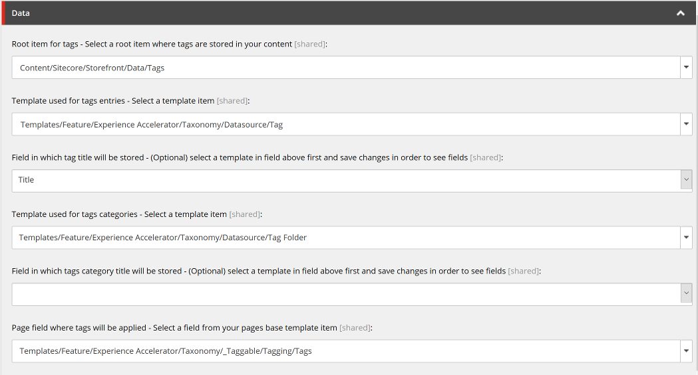

# Custom Content Tagger

Module allows Content Authors to use built-in [Sitecore Cortex Content Tagging](https://doc.sitecore.com/users/91/sitecore-experience-platform/en/tag-content-using-sitecore-cortex-content-tagging.html) feature with custom tags root item(s) and custom tag items structure. 
This gives more flexibility, cause by default content tagging applies tags to items in standard _Semantics field and stores the tags in item buckets, which are not easy to manage or reuse. 
Module is flexible and works with different tags structure, including custom or SXA. 

Modules solves some issues related with standard content tagging:

  - By default tags are stored in categories returned by tags discovery provider (e.g. [Open Calais](http://www.opencalais.com/)), but it can be manually adjusted afterwards and categories title can be changed.
  - Same tag items are not created multiple times. Module assigns to content items tags, which were created before. 
  - Tag items have title field, which can be adjusted or translated, after the generation, therefore they can be displayed on website, e.g. as search facets.

For SXA, Sitecore also offers its own [custom taxonomy provider](https://doc.sitecore.com/developers/sxa/18/sitecore-experience-accelerator/en/integrating-sxa-with-sitecore-cortex--content-tagging.html), which solves some of the problems listed above. 

----------

# Basic Usage

After the installation you need to configure the module by selecting your custom taxonomy structure in `/sitecore/system/Modules/CustomTaggerSettings` item:


Afterwards your content authors can use built-in "Tag Item" command from ribbon. 

  - New tags will appear in configured, content tags root item
  - Tags will by automatically assigned to the selected content item:


## Multisite Usage

By default module uses same configuration defined in `/sitecore/system/Modules/CustomTaggerSettings` item for all sites.

To define different configurations for multi-site solutions, where e.g. tags are defined in different root items, add more `CustomTaggerSettings` items and define site to settings mapping in configuration file:

```xml
<configuration xmlns:patch="http://www.sitecore.net/xmlconfig/" xmlns:role="http://www.sitecore.net/xmlconfig/role/">
<sitecore role:require="Standalone or ContentManagement">
    <customTagger type="Sc.CustomTagger.Settings.Models.CustomTaggerSitesMappingsModel, Sc.CustomTagger.Settings">
        <sitesMappings hint="raw:AddCustomTaggerSitesMappings">
            <site name="website1" settingsItemPath="/sitecore/system/Modules/CustomTaggerSettings1"/>
            <site name="website2" settingsItemPath="/sitecore/system/Modules/CustomTaggerSettings2"/>
        </sitesMappings>
    </customTagger>
</sitecore>
</configuration>
```

## Sample Configation for SXA

Sitecore SXA has its own Content Tags structure, to configure the module to work with SXA, create `CustomTaggerSettings` with following settings:


# Installation

To use the module you will need to:
- Install [Sitecore 9.1 (Initial Release)](https://dev.sitecore.net/Downloads/Sitecore_Experience_Platform/91/Sitecore_Experience_Platform_91_Initial_Release.aspx) or above.
- Configure content tagging dicovery provider. For example for [Open Calais](http://www.opencalais.com/) create new config file in `{sitecore website root}\App_Config\Environment\Sitecore.ContentTagging.OpenCalais.config` with following content:

```xml                                         
<?xml version="1.0" encoding="utf-8" ?>
<configuration xmlns:patch="http://www.sitecore.net/xmlconfig/" xmlns:role="http://www.sitecore.net/xmlconfig/role/">
    <sitecore role:require="Standalone or ContentManagement">
        <settings>
            <setting name="Sitecore.ContentTagging.OpenCalais.CalaisAccessToken" value="{your-token-value}" />
        </settings>
    </sitecore>
</configuration>
```

- Install [Sc.CustomTagger.zip](sc.package/Sc.CustomTagger.zip) package using Sitecore Installation Wizard.

## Manual Installation/Install from Source

* Clone repository.
* Update `publishUrl` to your Sitecore instance URL in `publishsettings.targets` file.
* Update path in `sourceFolderCustomTagger` variable to your local repository folder in `zz.Sc.CustomTagger.Serialization.Settings.config` file.
* Publish `Sc.CustomTagger` and `Sc.CustomTagger.Settings` projects from Visual Studio.
* Publish `Sc.CustomTagger.Serialization` project. This project contains Unicorn assemblies and configuration. If you already have Unicorn in your project you can deploy only `zz.Sc.CustomTagger.Serialization.Settings.config` file.  
* Go to http://your-sitecore-instance/unicorn.aspx and sync `Foundation.CustomTaggerSettings` project.

## Test Website Deployment

Source code contains sample website, which can be used to test functionality of the module. To install it:
* Follow the steps for manual installation of the module
* Publish `Sc.CustomTagger.SamplePageTags` project form Visual Studio.
* Go to http://your-sitecore-instance/unicorn.aspx and sync `Project.SamplePageTags` project.
* Test pages are installed under `/sitecore/content/SampleTagsHome` and `/sitecore/content/SampleTagsData` items.

# Original authors

First version of this module was created during [Sitecore Hackathon 2019](http://www.sitecorehackathon.org/) by:

  - [Tomasz Juranek](https://twitter.com/tjWhuu)
  - [Robert Debowski](https://twitter.com/robert_debowski)
  - [Rafal Dolzynski](https://www.linkedin.com/in/rafa%C5%82-do%C5%82%C5%BCy%C5%84ski-b4a2389b/)

Original code is available [here](https://github.com/Sitecore-Hackathon/2019-Las-Vegans/).
